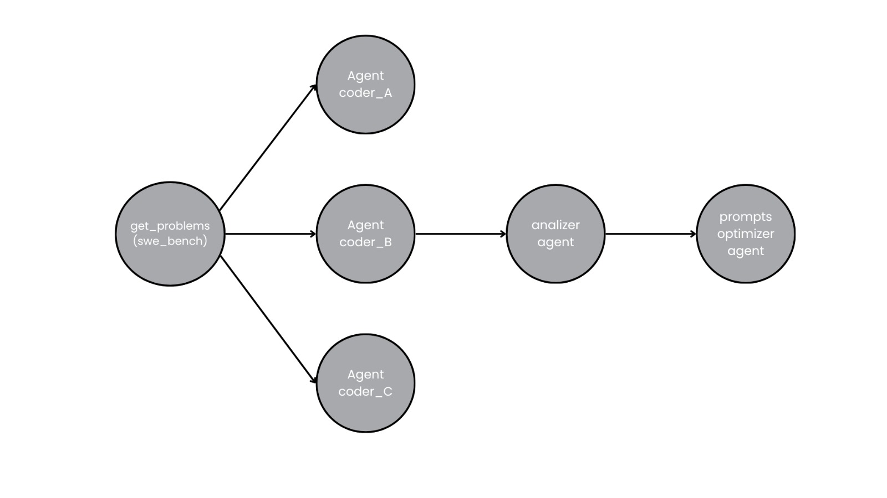

# Entropy Evolve
We propose the EntropyEvolve.

This architecture is a general framework for agents self-improvement, applicable to any complex domain such as science or medicine. However, we have chosen software engineering as our initial testing ground.

## Problem description
We have a base coding agent that we want to improve. Using a continuous improvement cycle, EntropyEvolve is able to continually improve itself with feedback from its errors.
## Architecture

## Instructions
git clone https://github.com/luisjosuecortes/EntropyEvolve.git

git clone https://github.com/SWE-bench/SWE-bench.git

cd SWE-bench

pip install -e .

cd ..

pip install langgraph

pip install openai

python cycle_graph.py

## Self improvement explication.

## Metric.
We used SWE-bench for testing o